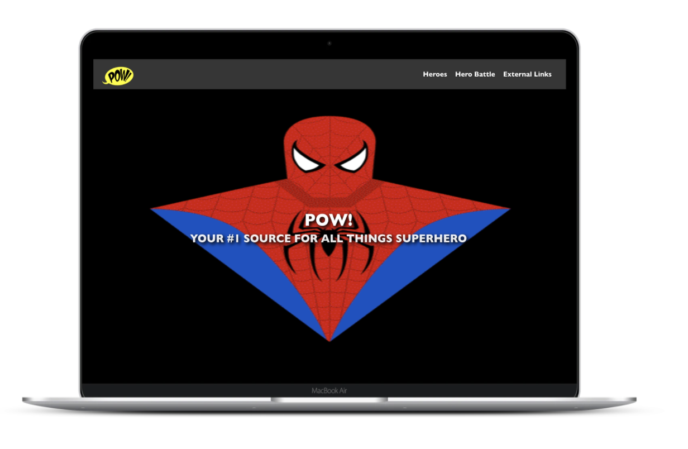
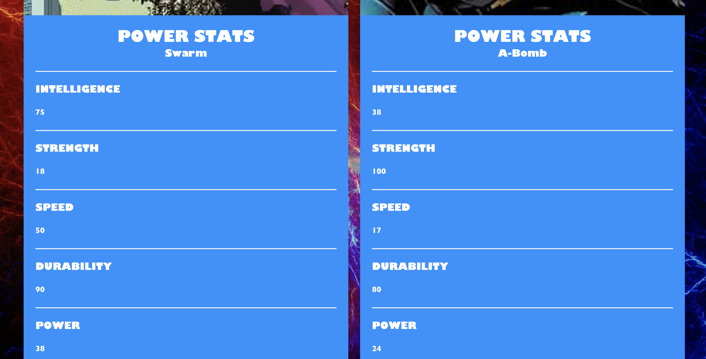
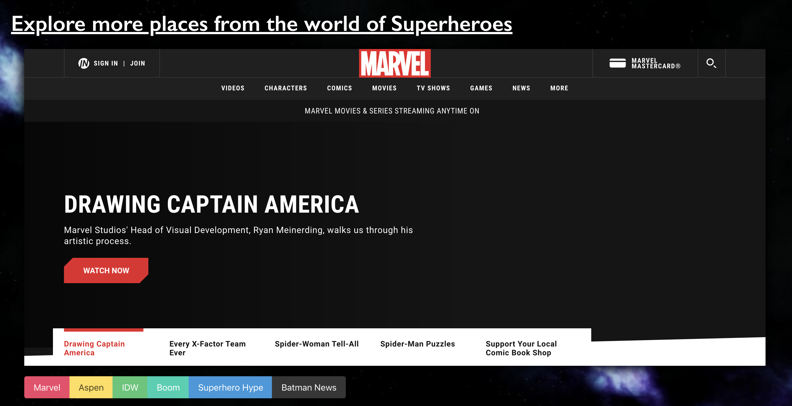

#  Project #2: Reacathon


# Software Engineering Immersive: Project 2
This was the second project built whilst studying the Software Engineering Immersive course at General Assembly.

This application was built in 2 days

## Getting Started
Use the clone button to download the source code. In the terminal enter the following commands...
```
<!-- To install all the  necesary packages: -->
$ npm i

<!-- Run the app in your localhost: -->
$ npm run start
```

# POW!

## Brief
Technical Requirements
Your app must:

* Consume a public API – this could be anything but it must make sense for your project.
* Have several components - At least one classical and one functional.
* The app should include a router - with several "pages".
* Include wireframes - that you designed before building the app.
* Have semantically clean HTML - you make sure you write HTML that makes structural sense rather than thinking about how it might look, which is the job of CSS.
* Be deployed online and accessible to the public.


## Tech Stack

+ HTML5
+ SCSS & Bulma
+ Javascript
* React.js
* Node.js
* Axios
* Git & GitHub
* Node Package Manager (NPM)
* Third-Party API (https://akabab.github.io/superhero-api/api/)

# Overview 

The project is a supehero Website where users can read and review information on certain superheros/villains. The website holds a vast amount of information about the heroes and villains that is derived from a resourceful third party API.

The website has a Top Trumps like feature where users can compare users and see whether a users favourite superhero can beat their nemesis. This is done by comparing the heroes/villains statistics to produce a winner and loser.

The website also features a superhero news section whiuch has links to a variety of superhero and comic websites where users can continue their search.
* HOMEPAGE


* HERO INDEX


* COMPARISON PAGE PT.1


* COMPARISON PAGE PT.2


* COMPARISON PAGE PT.3


* HERO NEWS PAGE


# Main Features & Challenges

# The Hero Search Form
There are two main search types that the user is allowed to use in this website.

 1. The first search function allows user to search superheros by name (basic search function).

 2. The other search function allows users to focus their search by selecting gender, alignment (good/bad), species and publisher (advanced search function). 

* Search Functions Displayed Here:
 ```js

   basicSearchFunction = (e) => {
    const searchData = this.state.data.filter(item => item.name.toLowerCase().includes(e.target.value.toLowerCase()))
    this.setState({ searchData })
  }

  searchFunction = (e) => {
    const searchParams = this.state.advancedSearchParameters
    searchParams[e.target.name] = e.target.value
    const searchData = this.state.data.filter(item => (
      (item.biography.alignment === searchParams.alignment || !searchParams.alignment) && 
      (item.appearance.gender === searchParams.gender || !searchParams.gender) && 
      (item.appearance.race === searchParams.race || !searchParams.race) && 
      (item.biography.publisher === searchParams.publisher || !searchParams.publisher)
    ))
    this.setState({ searchData, advancedSearchParameters: searchParams })
  }
 ```

 * Superhero Comparison Function displayed here:

 ```js
  findWinner = () => {
    const playerStatNames = Object.keys(this.state.firstChoice.powerstats)
    const playerStatValues = playerStatNames.map(item => this.state.firstChoice.powerstats[item])
    const playerTotal = playerStatValues.reduce((acc, i) => acc + i, 0)

    const compStatNames = Object.keys(this.state.secondChoice.powerstats)
    const compStatValues = compStatNames.map(item => this.state.secondChoice.powerstats[item])
    const compTotal = compStatValues.reduce((acc, i) => acc + i, 0)

    if (playerTotal > compTotal) {
      this.setState({ winner: 'firstChoice', gameInPlay: true })
    } else if (compTotal > playerTotal) {
      this.setState({ winner: 'secondChoice', gameInPlay: true })
    } else {
      this.setState({ gameInPlay: true })
    }
    
    console.log('First Choice:', playerTotal, 'Second Choice:', compTotal)
  }

  resetPage = () => {
    this.setState({ 
      gameInPlay: false, 
      gotFirstChoice: false, 
      gotSecondChoice: false, 
      winner: '', 
      firstChoice: this.state.data[0],
      secondChoice: this.state.data[0]
    })
  }

 ``` 
## Challenges and Improvements

### Wins
* I learnt a lot when building this app. Finding out how to effectively use a basic and advanced search function in conjunction with a third party API. I really enjoyed making the comparison tool as I used to love Top Trumps as a child, so seeing how I could implement this in javascript was a great feeling.

* My first oppotunity at pair-programming was a great experience and it taught me the importance of effectively communicating ideas and code to team-mates in a clear and concise well. Overall, I found programming to be more fun than challenging as I thought it was easy to bounce off someone else to make ideas and solutions to create a project that I am proud of.

### Challenges
The main challenges:
1. Allowing the user to switch between basic and advanced search functions and allow the user to keep their search parameters.
2. The comparison tool as the user has to pick two heroes/villains before the function can run. Finding a suitable way to implement this required a significant amount of planning.
3. The time constraint: Only having 48 hours to produce this did prove to be difficult as it was easy to get carried away with ideas, but at the end of the day we focused on the Minimum Viable Product (MVP) and then implemented nice-t0-haves if time permitted.

### Improvements
The improvements include:
1. Design a smaller, easier to see comparison page.
2. Improve the CSS and styling - the time constaint meant that we focused on the functionality before styling.

#### Author
Rory Fletcher


